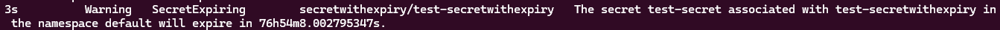

<a href="https://www.buymeacoffee.com/ladibnasr"></a>

# k8s-secret-expiry-controller

A Kubernetes controller that watches for the expiration of Kubernetes Secrets and raises events accordingly.

## Description

This project is a Kubernetes Operator built with Kubebuilder. It introduces a new Custom Resource Definition (CRD) `SecretWithExpiry` into the Kubernetes API, which is like a regular Secret but with an added expiry date.

## Getting Started

You’ll need a Kubernetes cluster to run against. You can use [KIND](https://sigs.k8s.io/kind) to get a local cluster for testing, or run against a remote cluster.

**Note:** Your controller will automatically use the current context in your kubeconfig file (i.e. whatever cluster `kubectl cluster-info` shows).

### Installing the CRDs into the Cluster

Install the CRDs into a cluster:

```sh
git clone https://github.com/devops-360-online/k8s-secret-expiry-controller.git
cd k8s-secret-expiry-controller
kubectl apply -k config/crd
kubectl apply -k config/default
```

### Creating a SecretWithExpiry Object

Create a new file named `secretWithExpiry.yaml` with the following contents:

```yaml
apiVersion: expiry.devops-360.online/v1
kind: SecretWithExpiry
metadata:
  name: example-secretwithexpiry
spec:
  secretName: my-secret
  expiryDate: "2023-06-30T00:00:00Z"
```

Replace `"2023-06-30T00:00:00Z"` with the actual expiry date you want for your secret. The date must be in the format `YYYY-MM-DDTHH:MM:SSZ`.

Then, apply this file:

```sh
kubectl apply -f secretWithExpiry.yaml
```

### Viewing SecretWithExpiry Events

To view the events associated with a SecretWithExpiry object:

```sh
kubectl describe secretwithexpiry example-secretwithexpiry
```

This command will output a description of the SecretWithExpiry object, including a list of recent events. The events will show if the secret has expired, is about to expire in less than 7 days, or if the expiry date has been updated.

Or

```sh
kubectl get events
```



## Build and push your image to the location specified by IMG

```sh
make docker-build docker-push IMG=<some-registry>/k8s-secret-expiry-controller:tag
```

## Deploy the controller to the cluster with the image specified by IMG

```sh
kubectl apply -k config/default
```

## Uninstall CRDs

To delete the CRDs from the cluster:

```sh
make uninstall
```

## Undeploy Controller

UnDeploy the controller from the cluster:

```sh
make undeploy
```

## Contributing

This project welcomes contributions. Please feel free to submit pull requests for bug fixes, improvements or new features.

## How It Works

This project aims to follow the Kubernetes Operator pattern. It uses Controllers, which provide a reconcile function responsible for synchronizing resources until the desired state is reached on the cluster.

## Test It Out

Install the CRDs into the cluster:

```sh
make install
```

Run your controller (this will run in the foreground, so switch to a new terminal if you want to leave it running):

```sh
make run
```

NOTE: You can also run this in one step by running: make install run

## Modifying the API Definitions

If you are editing the API definitions, generate the manifests such as CRs or CRDs using:

```sh
make manifests
```

NOTE: Run `make --help` for more information on all potential make targets.

More information can be found via the [Kubebuilder Documentation](https://book.kubebuilder.io/introduction.html).

## License

This project is licensed under the Apache 2.0 License. See the LICENSE file for details.
